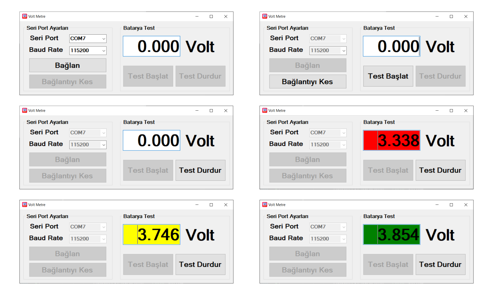

# Arduino-C#-Voltmetre

## Arduino ile Voltmetre Yapımı  
Arduino ile voltajı ölçüyoruz ve bilgisayara bağlıyken C# form uygulaması ile ölçtüğümüz voltajı görebiliyoruz.  
Voltaj değerine göre metinin arka planındaki renkler değişiyordur.  
- 3.0 ile 3.4 arasında ise Kırmızı,  
- 3.4 ile 3.8 arasında ise Sarı,  
- 3.8 ile 4.2 arasında ise Yeşil,  
- Diğer aralıklarda ise Beyaz renk oluyordur.  

## Daha farklı projeler için [instagram adresimi](https://www.instagram.com/bluegrays.ino/) takip edebilirsiniz. 

